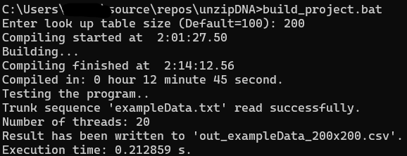

# DNA Unzipping Curve Calculator (ver.3)
  
## How to build the project

This command should work on Windows and Linux.
  
>g++ -std=c++20 -fconstexpr-ops-limit=100000000000 main.cpp utils.cpp -DJ_SIZE=200 -DEXT_SIZE=200 -o UnzipDNA.exe

For Windows OS, run **build_project.bat** to build with additional options and testing.  If the batch file is ran successfully, you should see something like this:

(For Linux user, ChatGPT should be able to translate the .bat file to a shell script.)  

The lookup table size is controlled by macro **J_SIZE**. The larger the number, the accurate the result. Increasing this number can significantly increase the compiling time.
  
## Do some tests using the example data

I attached a gene from NEB's H5alpha (genebank, CP017100), you can run the executable like this:  
  
>UnzipDNA.exe NEB_H5alpha_Accessory_colonization_factor_AcfD.txt out.csv

The first argument is input file name. The second argument determines the output file name and is optional.  
  
## Goal of this program

My goal is to make the unzipping curve calculation fast (so I can calculate the unzipping curves of thousands of genes in an acceptable time). However, there is no better method other than brute-force partition function calculation for now. The only thing I can do is to make each loop faster. I can calculate something ahead of time and save it in the program.

It took some thinking to move majority of calculation from run-time to compile time. After several attempts, I **"constexpred"** most of the calculation overhead. Two look-up tables (LUTs) are created to hold these data. These LUTs are saved in **constexpr std::arrays** so I have to use c++20 (or above). The drawback is that the compile time is very long, thousands of times longer than a straightforward c++ program.  
  
On Aug/15/2023, I implemented multithreading. The execution speed increased by another factor of 10-20.  
  
*At the current stage, this program is ~ 10,000 times faster than my proof-of-concept python code.*
  
## DNA unzipping theory

**Figure above shows DNA unzipping experiment on a 4.4 kb DNA**. Single-molecule measurement (blue) and the prediced curve by this program (black) agree well.  
  
Further reading on DNA unzipping experiment and theory:  

[1] Essevaz-Roulet, Baptiste, Ulrich Bockelmann, and Francois Heslot. (1997) PNAS  
[2] Bockelmann, Ulrich, et al. (2002) Biophysical journal  
[3] Huguet, Josep M., et al. (2010) PNAS  
